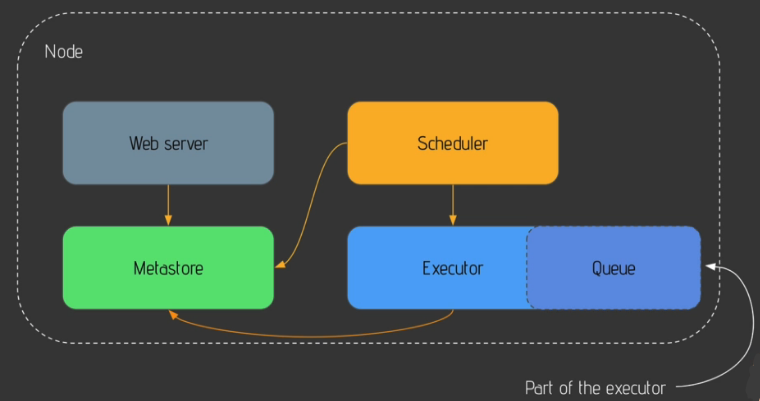
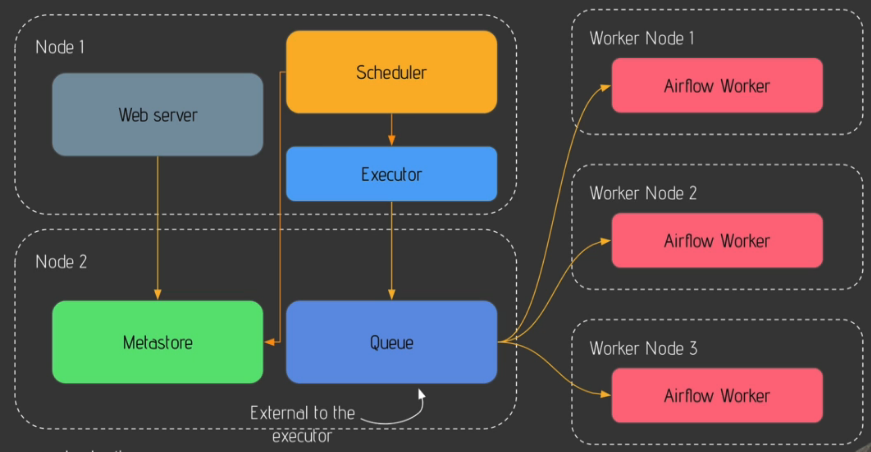

# Getting started with Airflow

## What is Airflow?

Apache Airflow is an open source platform to programmatically author, schedule, and monitor workflows. It works as an orchestrator to execute the tasks in the right order and at the right time. Airflow is extensible. We can make plugins for Airflow to integrate with other tools not readily available.

Airflow core components:

- **Web server:** Airflow uses a Flask server with Gunicorn serving the UI.
- **Scheduler:** Daemon in charge of scheduling workflows.
- **Metastore:** database where all metadata related to your workflows will be stored. Recommended DB is PostgreSQL, but any SQL-Alchemy compatible DB can be used.
- **Executor:** this is a Python class that defines how the tasks will be executed.
- **Worker:** is the process or sub-process that executes the task

Airflow core concepts:

- **DAGs:** tasks are represented in DAGs. They map dependencies.
- **Operator:** wrapper around the task
  - Action operators execute functions or commands.
  - Transfer operators allow us to transfer data from a source to a destination
  - Sensor operators wait for an event before moving on to the next task
- **Task:** a task is an operator in the data pipeline
- **Task instance:** a task that is being executed
- **Workflow:** the combination of all previous concepts

## How Airflow works?

The single node architecture uses a single machine to run workflows. The Web server fetches data coming from the Metastore. The Scheduler and the Executor will talk with the Metastore to run the workflows as needed, and report back the status of the workflows. The Executor has a Queue which defines the order in which the tasks are executed.

The multi node architecture allows you to run as many tasks as needed. In this architecture, the first node will run the Web Server, the Scheduler, and the Executor. The second node will run the Metastore, and the Queue. Worker nodes will be in charge of running the tasks. 

All python scripts that describe the workflows will be stored in a directory accessible by both the Web server and the Scheduler. These will parse the file in order to be aware of the DAGs. Once parsed, the Scheduler will create a DAGRun object and communicate it to the Metastore. Once a DAGRun object is present in the Metastore, a Task Instance object will be created for the Executor to utilize. Once the Executor runs the Task Instance object, it will update the status of it in the Metastore. Each time the status in the Metastore is updated, the Web UI is updated.
